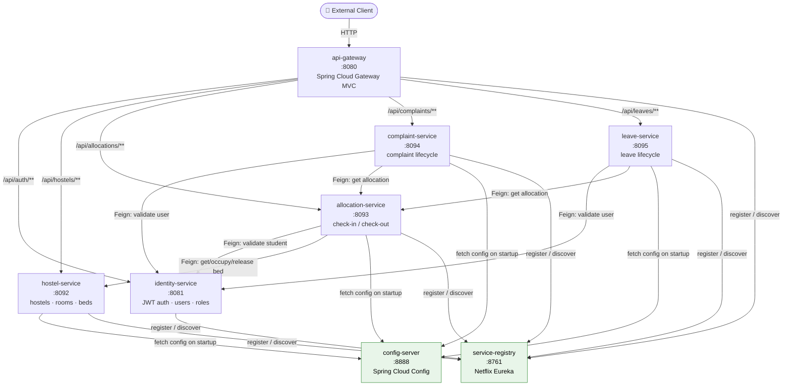

# HostelHub — Hostel Management System


A **microservice backend** for student hostel operations: bed allocation, leave management, and complaint tracking. Built with Spring Boot 4 and Spring Cloud, using Netflix Eureka for service discovery and a centralized config server — demonstrated across six independently deployable services behind an API gateway.

> **Portfolio note:** This is an actively developed project. Authorization hardening (Stage 3) is in progress. See [Known Issues / Roadmap](#known-issues--roadmap) for the honest picture.

---

## Table of Contents

- [Project Highlights](#project-highlights)
- [Architecture](#architecture)
- [Tech Stack](#tech-stack)
- [Quick Start](#quick-start)
- [Setup & Environment](#setup--environment)
- [Documentation](#documentation)
- [Contributing](#contributing)
- [Known Issues / Roadmap](#known-issues--roadmap)
- [Changelog](#changelog)

---

## Project Highlights

> For a recruiter skimming in 30 seconds.

| What | Detail |
|------|--------|
| **Microservice architecture** | 6 business services + gateway + Eureka + config-server. Each service owns its own PostgreSQL database; no shared schema. |
| **Service discovery** | Netflix Eureka. All inter-service Feign calls resolve by service name (`lb://`), no hardcoded URLs. |
| **Centralized configuration** | Spring Cloud Config Server (native profile) centralises DB URLs, ports, and JPA settings for 4 of the 6 business services. |
| **API gateway routing** | Spring Cloud Gateway (MVC) routes all external traffic; one stable entry point regardless of which services are deployed. |
| **JWT authentication** | identity-service issues HS256 JWTs (15-min access token + 7-day refresh token). Spring Security + `JwtAuthenticationFilter` enforces auth on identity-service itself. |
| **Role model** | Four roles (`STUDENT`, `WARDEN`, `ADMIN`, `SYSTEM_ADMIN`) defined in code; business rules for STUDENT and WARDEN are enforced via Feign-based identity lookups today. |
| **Business rule depth** | Date overlap validation, status machine enforcement, optimistic locking (`@Version`), and cross-service UUID referencing with Feign verification at allocation time. |

---

## Architecture



> **Call directions:** All Feign calls use Eureka service-name resolution. The gateway does path-based routing only — no auth filtering today (see [Known Issues](#known-issues--roadmap)). Internal endpoints (`/api/internal/**`) bypass the gateway and are on direct service ports.

---

## Tech Stack

| Layer | Technology | Version |
|-------|-----------|---------|
| Language | Java | 17 |
| Framework | Spring Boot | 4.1.0 |
| Cloud | Spring Cloud | 2025.1.2 |
| Service discovery | Spring Cloud Netflix Eureka | (via Spring Cloud BOM) |
| API gateway | Spring Cloud Gateway MVC | (via Spring Cloud BOM) |
| Feign clients | Spring Cloud OpenFeign | (via Spring Cloud BOM) |
| Database | PostgreSQL | (runtime; schema via Hibernate DDL auto) |
| ORM | Spring Data JPA / Hibernate | (via Spring Boot BOM) |
| Security | Spring Security + jJWT | Spring Boot 4.1.0 / jJWT 0.12.6 |
| Validation | Jakarta Bean Validation | (via Spring Boot BOM) |
| Boilerplate | Lombok | (via Spring Boot BOM) |
| Build | Maven | — |

> All services compile at `java.version=17` and share the same Spring Boot parent POM (`4.1.0`).

---

## Quick Start

### Prerequisites

- Java 17+
- Maven 3.9+
- PostgreSQL running locally
- Databases created: `identity_db`, `hostel_db`, `allocation_db`, `complaint_db`, `hostelhub_leave_db`

### Start order (dependency graph)

Services must start in this order because downstream services need config-server and Eureka before they can register:

```
① config-server    (port 8888)  — no dependencies; start first
② service-registry (port 8761)  — no config-server dependency; start before any business service
③ [parallel]
   identity-service  (port 8081) — uses local config; needs Eureka only
   hostel-service    (port 8092) — needs config-server + Eureka
   allocation-service(port 8093) — needs config-server + Eureka
   complaint-service (port 8094) — needs config-server + Eureka
   leave-service     (port 8095) — needs config-server + Eureka
④ api-gateway       (port 8080) — needs Eureka to resolve lb:// routes; start last
```

### Commands

```bash
# In separate terminals (or background):

cd config-server     && mvn spring-boot:run
cd service-registry  && mvn spring-boot:run

# Wait until Eureka dashboard is up at http://localhost:8761

cd identity-service  && mvn spring-boot:run
cd hostel-service    && mvn spring-boot:run
cd allocation-service && mvn spring-boot:run
cd complaint-service && mvn spring-boot:run
cd leave-service     && mvn spring-boot:run

# Wait until all 5 services appear registered in Eureka

cd api-gateway       && mvn spring-boot:run
```

### Verify

| Check | URL |
|-------|-----|
| Eureka dashboard | http://localhost:8761 |
| Gateway health | http://localhost:8080/actuator/health |
| Identity health | http://localhost:8081/actuator/health |
| Register a student | `POST http://localhost:8080/api/auth/register` |

### Database configuration

Default credentials used in config-server properties:
- **Host:** `localhost:5432`
- **Password:** `mohini` (all services except leave-service which uses `postgres` — see [Known Issues](#known-issues--roadmap))
- **Username:** `postgres` (confirm per service's local `application.properties`)

> For the full setup walkthrough including SQL to create databases, per-service credential table, and `application-local.properties` template, see **[SETUP.md](SETUP.md)**.

---

## Setup & Environment

See **[SETUP.md](SETUP.md)** for:
- Full database creation SQL
- Per-service credentials table
- Environment variable reference
- `application-local.properties` template (kept out of git)
- Troubleshooting guide

---

## Documentation

Full technical documentation lives in [`docs/`](docs/README.md).

| Document | What's in it |
|----------|-------------|
| [📋 Docs Index](docs/README.md) | Navigation hub — reading order for new contributors |
| **Architecture** | |
| [System Overview](docs/architecture/SYSTEM_OVERVIEW.md) | Cross-service architecture, service map, all verified findings from source analysis |
| [Service Call Graph](docs/architecture/service-diagram.md) | Mermaid diagram: who calls whom |
| [Deployment Order](docs/architecture/deployment-diagram.md) | Mermaid diagram: startup dependency graph |
| **Diagrams** | |
| [Entity Relationship Diagram](docs/diagrams/README.md#entity-relationship-diagram) | All entities across 5 databases with cross-service UUID reference annotations |
| [Data Flow Diagram](docs/diagrams/README.md#full-request-data-flow) | End-to-end: Register → Allocate → Leave → Complaint |
| [JWT Auth Sequence Diagram](docs/diagrams/README.md#jwt-authentication-flow) | Token issuance, refresh, and current auth gaps |
| **Per-Service Docs** | |
| [identity-service](docs/services/identity-service.md) | JWT auth, user model, token lifecycle |
| [hostel-service](docs/services/hostel-service.md) | Hostel → Room → Bed hierarchy, business rules |
| [allocation-service](docs/services/allocation-service.md) | Allocation lifecycle, Feign dependencies, race condition note |
| [complaint-service](docs/services/complaint-service.md) | Complaint status machine, validation rules |
| [leave-service](docs/services/leave-service.md) | Leave status machine, optimistic locking, date validation |
| [api-gateway](docs/services/api-gateway.md) | Route table, what the gateway does and does not do |
| [config-server](docs/services/config-server.md) | What is / isn't centralised |
| [service-registry](docs/services/service-registry.md) | Eureka server config |
| **Auth** | |
| [Authentication Flow](docs/auth/AUTHENTICATION.md) | JWT lifecycle, token claims |
| [Authorization Gaps](docs/auth/AUTHORIZATION_GAPS.md) | Full gap inventory from source analysis |
| [Roles & Permissions](docs/auth/ROLES_AND_PERMISSIONS.md) | Role × Action × Service permission matrix |
| **API** | |
| [API Testing Guide](docs/api/API_TESTING.md) | Full endpoint inventory with curl examples and failure cases |
| [Postman Collection](docs/api/postman/HostelHub.postman_collection.json) | Import-ready collection with environment variables |

---

## Contributing

See **[CONTRIBUTING.md](CONTRIBUTING.md)** for:
- Prerequisites (Java 17, Maven 3.9, PostgreSQL)
- Step-by-step local run instructions
- Code style conventions
- PR guidelines

---

## Known Issues / Roadmap

These are **identified, documented, and actively being addressed** — not hidden. A technical reviewer will find them in the source anyway; owning them here is more credible.

### Authorization boundaries (Stage 3 — in progress)

The biggest gap in the current codebase is that **authentication exists but authorization does not propagate** past identity-service:

| Finding | Risk | Status |
|---------|------|--------|
| API gateway does not validate JWT tokens before forwarding | HIGH | 🔧 In progress — gateway JWT filter planned |
| Business services (hostel, allocation, complaint, leave) have no Spring Security | HIGH | 🔧 Adding `@PreAuthorize` per service |
| Caller identity proven only by UUID query param (`?studentId=`) — impersonation possible | CRITICAL | 🔧 Replacing with JWT-extracted claims |
| `/api/internal/**` endpoints exposed on direct service ports, no auth | HIGH | 🔧 Shared secret header or network policy planned |
| Warden/admin creation endpoints are `permitAll()` — anyone can create | HIGH | 🔧 Restricting to `ROLE_ADMIN` |
| JWT secret hardcoded in `application.properties` | HIGH | 🔧 Moving to environment variable |

> Full gap inventory with per-endpoint detail: [docs/auth/AUTHORIZATION_GAPS.md](docs/auth/AUTHORIZATION_GAPS.md)

### Other identified items

| Finding | Detail |
|---------|--------|
| `test-service` is scaffolding | One endpoint (`GET /api/test/hello`), no business logic — registered in Eureka and routed through gateway. Will be removed before any deployment. |
| `HostelWarden` entity is orphaned | Entity and table defined in hostel-service with no repository, service, or controller. Intended for future warden-hostel assignment flow. |
| `closedBy`, `rejectionReason`, `escalated` fields never populated | Defined in complaint and leave entities; no code path sets them. Mapped for future use. |
| `SYSTEM_ADMIN` role defined but unused | Enum value exists in identity-service with no business rule referencing it. |
| leave-service DB password inconsistency | Config-server has `password=postgres` for leave-service; all other services use `password=mohini`. |
| leave-service NPE on missing allocation | `fetchAllocation()` returns `null` for students with no active allocation; downstream code dereferences it without a null check. |

---

## Changelog

See [CHANGELOG.md](CHANGELOG.md).
