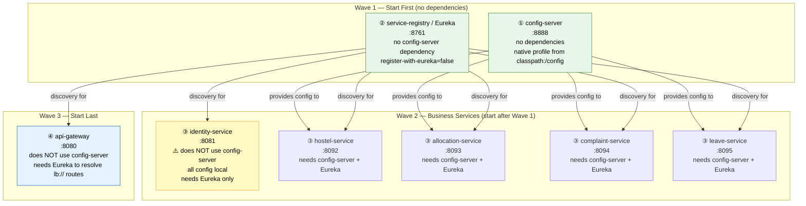

# Deployment Diagram

> Mermaid diagram showing the required startup order and dependency relationships.
> Source: Stage 1 source-code analysis of `spring.config.import` and `eureka.client.service-url.defaultZone` settings found in each service.

---

## Startup Order & Dependency Graph

---

## Startup Order — Quick Reference Table

| Order | Service | Port | Config Source | Eureka |
|-------|---------|------|---------------|--------|
| ① | config-server | 8888 | Local `application.properties` | ❌ not registered |
| ② | service-registry | 8761 | Local `application.properties` | ❌ self (server) |
| ③ | identity-service | 8081 | **Local only** — no `spring.config.import` | ✅ |
| ③ | hostel-service | 8092 | config-server → `hostel-service.properties` | ✅ |
| ③ | allocation-service | 8093 | config-server → `allocation-service.properties` | ✅ |
| ③ | complaint-service | 8094 | config-server → `complaint-service.properties` | ✅ |
| ③ | leave-service | 8095 | config-server → `leave-service.properties` | ✅ |
| ④ | api-gateway | 8080 | Local `application.properties` | ✅ |

> Wave 3 services (HS, AS, CS, LS) use `optional:configserver:http://localhost:8888` — the `optional:` prefix means they **start without error** if config-server is down, but may have missing DB/Eureka config.

---

## Key Observations

| Observation | Detail |
|-------------|--------|
| `identity-service` skips config-server | It does NOT set `spring.config.import`. All config (port, DB URL, JWT secret, Eureka) is in local `application.properties`. It is the only business service that does this. |
| `api-gateway` skips config-server | All route definitions are in local `application.properties`. |
| `service-registry` skips config-server | Pure Eureka server; no dynamic config needed. |
| `optional:` import prefix | Business services start without error if config-server is unavailable. They may silently miss DB config and fail at first DB operation. No `fail-fast=true` or retry config found. |
| No health-check wait mechanism | Nothing in the codebase delays service startup until dependencies are confirmed healthy. Manual ordering is required when starting locally. |
| Wave 3 services can start in parallel | hostel, allocation, complaint, and leave services have no dependency on each other at startup — only on config-server and Eureka. |

---

## See Also

- [service-diagram.md](service-diagram.md) — service-to-service call graph
- [config-server.md](../services/config-server.md) — what config-server centralises
- [SYSTEM_OVERVIEW.md](SYSTEM_OVERVIEW.md) — full cross-service analysis
