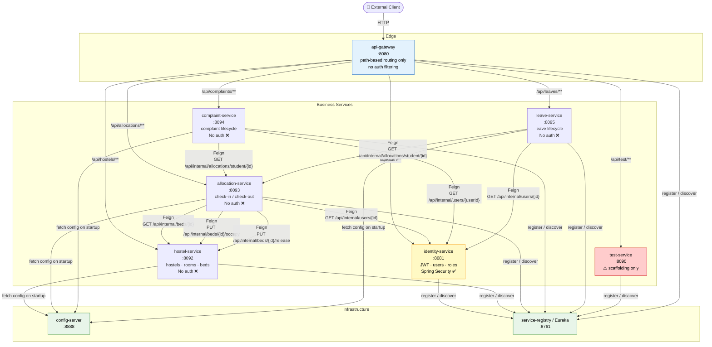

# Service Call Graph

> Mermaid diagram showing all services and their verified call directions.
> Source: Stage 1 source-code analysis — every arrow corresponds to a Feign client or gateway route found in code.

---

## Service-to-Service Call Graph

---

## Notes

| Symbol | Meaning |
|--------|---------|
| 🟡 (yellow) | identity-service — the only service with Spring Security |
| 🔴 (red) | test-service — scaffolding; no business logic; should be removed |
| 🔵 (blue) | api-gateway — routes traffic; no auth filtering today |
| 🟢 (green) | Infrastructure services (config-server, Eureka) |

### Key architectural properties (verified from source)

- **No hardcoded IP/port URLs** — all Feign clients resolve by Eureka service name (`@FeignClient(name = "...")`)
- **Gateway does no auth filtering** — it is a pure path-based proxy; tokens (or lack of tokens) pass through unchanged
- **`/api/internal/**` bypasses the gateway** — these endpoints live on direct service ports with no auth whatsoever
- **`hostel-service` has `@EnableFeignClients`** declared but no Feign client interfaces are defined in its source tree (no outbound Feign calls)
- **All four business services (hostel, allocation, complaint, leave) have zero Spring Security** — see [AUTHORIZATION_GAPS.md](../auth/AUTHORIZATION_GAPS.md)

---

## See Also

- [deployment-diagram.md](deployment-diagram.md) — startup order and dependency graph
- [SYSTEM_OVERVIEW.md](SYSTEM_OVERVIEW.md) — full cross-service analysis
- [AUTHORIZATION_GAPS.md](../auth/AUTHORIZATION_GAPS.md) — security gap inventory
