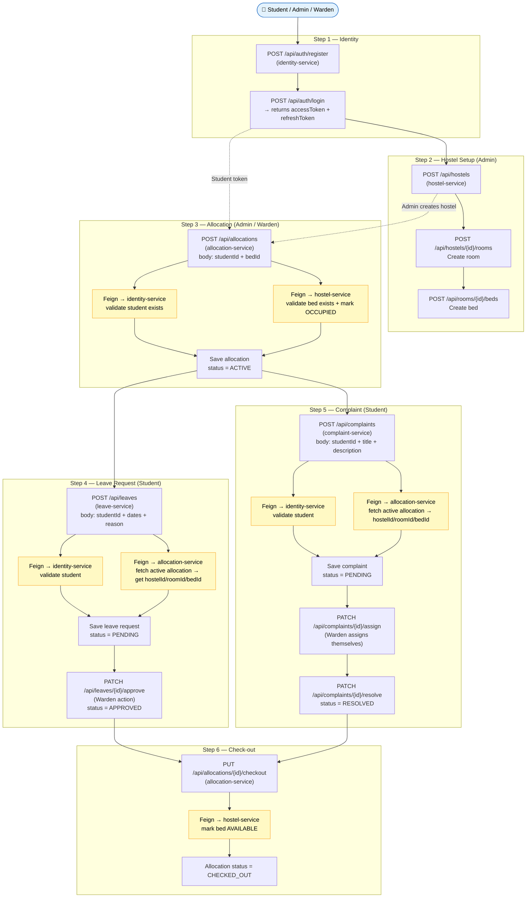
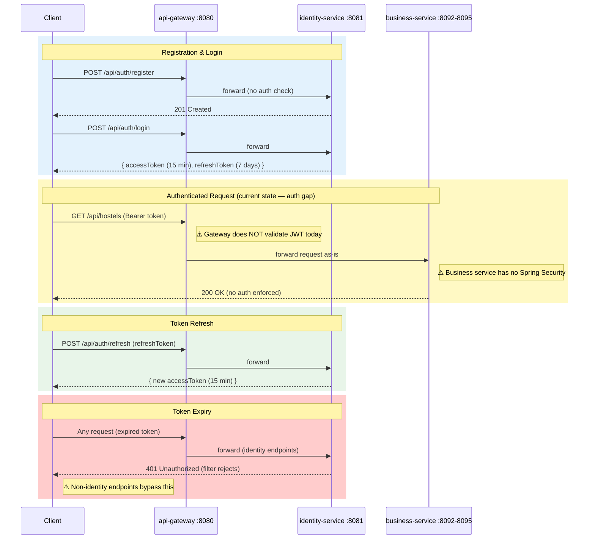

# Diagrams

This folder holds standalone diagram documents using [Mermaid](https://mermaid.js.org/) syntax, rendered automatically by GitHub.

| Diagram | What it shows |
|---------|---------------|
| [Entity Relationship Diagram](#entity-relationship-diagram) | All entities across all 5 databases and their cross-service UUID references |
| [Full Request Data-Flow](#full-request-data-flow) | End-to-end flow: Register → Allocate → Leave → Complaint |
| [JWT Authentication Flow](#jwt-authentication-flow) | Token issuance, refresh, and validation lifecycle |

> **Note:** Detailed service-call graphs and deployment order are in [`architecture/`](../architecture/).

---

## Entity Relationship Diagram

> Cross-service UUID references are marked with `||--o{` (one-to-many) or annotated in notes.
> Because each service owns a separate PostgreSQL database, these are **logical** relationships — no database-level foreign keys cross service boundaries.

```mermaid
erDiagram
    %% ─── identity_db ───────────────────────────────────────
    USER {
        UUID   id           PK
        string firstName
        string lastName
        string email        UK
        string passwordHash
        UUID   hostelId     "logical ref → hostel_db.hostel.id (not enforced)"
        enum   role         "STUDENT | WARDEN | ADMIN | SYSTEM_ADMIN"
    }

    ROLE {
        UUID   id   PK
        string name "STUDENT | WARDEN | ADMIN | SYSTEM_ADMIN"
    }

    REFRESH_TOKEN {
        UUID      id        PK
        string    token     UK
        boolean   revoked
        timestamp expiresAt
        UUID      userId    FK
    }

    USER ||--o{ REFRESH_TOKEN : "has"

    %% ─── hostel_db ──────────────────────────────────────────
    HOSTEL {
        UUID   id       PK
        string name
        string address
        UUID   adminId  "logical ref → identity_db.user.id"
    }

    ROOM {
        UUID    id       PK
        string  roomNo
        int     capacity
        UUID    hostelId FK
    }

    BED {
        UUID    id       PK
        string  bedNo
        enum    status   "AVAILABLE | OCCUPIED"
        UUID    roomId   FK
        UUID    hostelId "denormalized for lookup speed"
    }

    HOSTEL_WARDEN {
        UUID id       PK
        UUID hostelId FK
        UUID wardenId "logical ref → identity_db.user.id"
    }

    HOSTEL ||--o{ ROOM        : "has"
    ROOM   ||--o{ BED         : "has"
    HOSTEL ||--o{ HOSTEL_WARDEN : "assigned"

    %% ─── allocation_db ──────────────────────────────────────
    ALLOCATION {
        UUID      id          PK
        UUID      studentId   "logical ref → identity_db.user.id ✅ Feign-verified"
        UUID      bedId       "logical ref → hostel_db.bed.id   ✅ Feign-verified"
        UUID      hostelId    "logical ref → hostel_db.hostel.id ❌ copied, not verified"
        UUID      roomId      "logical ref → hostel_db.room.id  ❌ copied, not verified"
        date      checkInDate
        date      checkOutDate
        enum      status      "ACTIVE | CHECKED_OUT"
        int       version     "@Version optimistic lock"
    }

    %% ─── complaint_db ───────────────────────────────────────
    COMPLAINT {
        UUID      id               PK
        UUID      studentId        "logical ref → identity_db.user.id ✅ Feign-verified"
        UUID      hostelId         "logical ref → hostel_db.hostel.id ❌ from allocation"
        UUID      roomId           "logical ref → hostel_db.room.id  ❌ convention"
        UUID      bedId            "logical ref → hostel_db.bed.id   ❌ convention"
        string    title
        string    description
        enum      status           "PENDING | IN_PROGRESS | RESOLVED | CLOSED"
        UUID      assignedWardenId "logical ref → identity_db.user.id"
        UUID      closedBy         "not yet populated"
        string    rejectionReason  "not yet populated"
        boolean   escalated        "not yet populated"
        timestamp createdAt
        timestamp updatedAt
    }

    %% ─── hostelhub_leave_db ─────────────────────────────────
    LEAVE_REQUEST {
        UUID      id          PK
        UUID      studentId   "logical ref → identity_db.user.id ✅ Feign-verified"
        UUID      hostelId    "logical ref → hostel_db.hostel.id ❌ from allocation"
        UUID      roomId      "logical ref → hostel_db.room.id  ❌ from allocation"
        UUID      bedId       "logical ref → hostel_db.bed.id   ❌ from allocation"
        date      startDate
        date      endDate
        string    reason
        enum      status      "PENDING | APPROVED | REJECTED | CANCELLED"
        UUID      reviewedBy  "logical ref → identity_db.user.id"
        string    rejectionReason "not yet populated"
        boolean   escalated       "not yet populated"
        int       version         "@Version optimistic lock"
        timestamp createdAt
        timestamp updatedAt
    }
```

### Cross-Service UUID Reference Legend

| Symbol | Meaning |
|--------|---------|
| ✅ Feign-verified | At write time, a Feign call to the owning service confirms the ID exists |
| ❌ convention only | UUID is stored as a plain column; no verification at write time |

---

## Full Request Data-Flow

> Traces the most common student journey from registration to submitting a complaint.

> 🟡 Yellow nodes = Feign calls to another service.

---

## JWT Authentication Flow

> The red section illustrates the current authorization gap documented in [`docs/auth/AUTHORIZATION_GAPS.md`](../auth/AUTHORIZATION_GAPS.md). Stage 3 (in progress) will add JWT validation at the gateway and `@PreAuthorize` guards in all business services.

---

## See Also

- [service-diagram.md](../architecture/service-diagram.md) — full service-to-service call graph
- [deployment-diagram.md](../architecture/deployment-diagram.md) — startup order
- [SYSTEM_OVERVIEW.md](../architecture/SYSTEM_OVERVIEW.md) — complete source analysis
- [AUTHORIZATION_GAPS.md](../auth/AUTHORIZATION_GAPS.md) — security gap inventory
