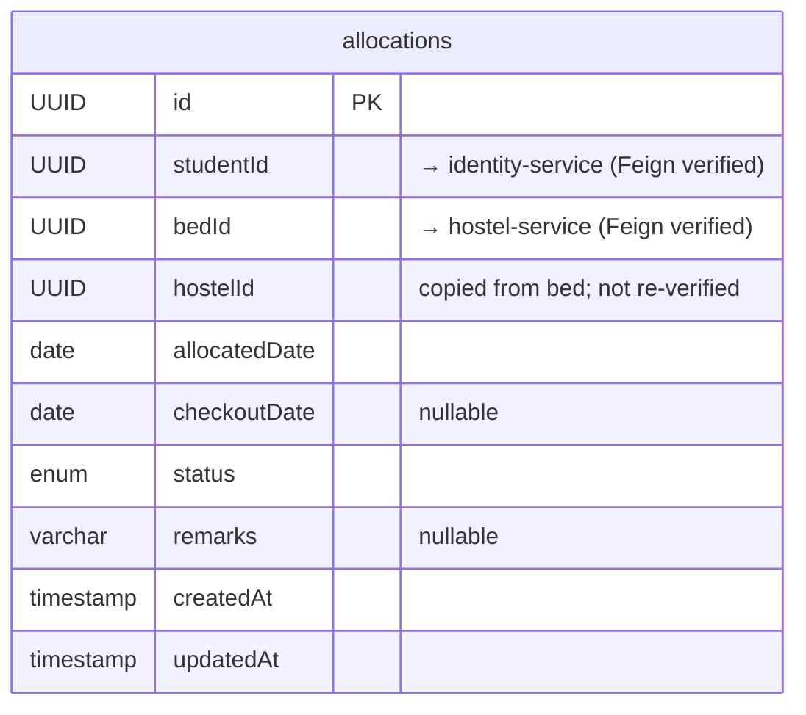

# Allocation Service

> Port: **8093** · DB: `allocation_db` (PostgreSQL) · Config: config-server

---

## Responsibility

Manages the lifecycle of a student's bed allocation (check-in / check-out).
Acts as the authority for "which student is in which bed/room/hostel right now."
Other services (complaint, leave) call it to discover a student's current hostel context.

---

## Endpoints

### Public (no auth enforced)

(`AllocationController.java`)

| Method | Path | Purpose |
|--------|------|---------|
| `POST` | `/api/allocations` | Create a new allocation |
| `GET` | `/api/allocations/{id}` | Get allocation by ID |
| `GET` | `/api/allocations/student/{studentId}` | List all allocations for a student |
| `POST` | `/api/allocations/{id}/checkout` | Check out (terminate) an allocation |

### Internal (used by other services via Feign)

(`InternalAllocationController.java`)

| Method | Path | Callers | Purpose |
|--------|------|---------|---------|
| `GET` | `/api/internal/allocations/student/{studentId}` | complaint-service, leave-service | Get a student's current ACTIVE allocation (hostelId, roomId, bedId) |

---

## Entities / Data Model

### `allocations` table (`Allocation.java`)

| Field | Type | Nullable | Notes |
|-------|------|----------|-------|
| `id` | UUID (PK) | no | |
| `studentId` | UUID | no | → identity-service user; **verified via Feign at create time** |
| `bedId` | UUID | no | → hostel-service bed; **verified via Feign at create time** |
| `hostelId` | UUID | no | copied from `bed.hostelId` at creation — not independently verified |
| `allocatedDate` | date | no | set to `LocalDate.now()` at create |
| `checkoutDate` | date | yes | set on checkout |
| `status` | enum (`ACTIVE`, `COMPLETED`, `CANCELLED`) | no | default `ACTIVE` |
| `remarks` | varchar(500) | yes | |
| `createdAt` | timestamp | no | |
| `updatedAt` | timestamp | no | |

---

## ER Diagram

---

## Service Dependencies

| Direction | Service | How | Reason |
|-----------|---------|-----|--------|
| Calls | identity-service | Feign `GET /api/internal/users/{id}` | Validate student exists, is active, has role STUDENT |
| Calls | hostel-service | Feign `GET /api/internal/beds/{id}` | Validate bed exists and is AVAILABLE |
| Calls | hostel-service | Feign `PUT /api/internal/beds/{id}/occupy` | Mark bed OCCUPIED on allocation |
| Calls | hostel-service | Feign `PUT /api/internal/beds/{id}/release` | Mark bed AVAILABLE on checkout |
| Called by | complaint-service | Feign | Internal allocation lookup |
| Called by | leave-service | Feign | Internal allocation lookup |

---

## Business Rules (from `AllocationServiceImpl.java`)

| Rule | Where enforced |
|------|---------------|
| Student must be ACTIVE | `!student.active()` check after Feign call |
| User must have role `STUDENT` | `roles.stream().anyMatch("STUDENT"::equals)` |
| Student can only have one ACTIVE allocation at a time | `existsByStudentIdAndStatus(studentId, ACTIVE)` |
| Bed must have status `AVAILABLE` | `bed.status() != AVAILABLE` check |
| Bed must not already have an active allocation | `existsByBedIdAndStatus(bedId, ACTIVE)` |
| Checkout only allowed on ACTIVE allocations | `allocation.getStatus() != ACTIVE` check |
| `hostelId` on allocation is derived from bed (not from request) | `bed.hostelId()` used at build time |

---

## Authorization Gaps

**No Spring Security.** No JWT filter.

| Endpoint | Who should be allowed | What's enforced | Gap |
|----------|-----------------------|-----------------|-----|
| `POST /api/allocations` | ADMIN / WARDEN only | Nothing | Any caller can allocate any student |
| `POST /api/allocations/{id}/checkout` | ADMIN / WARDEN only | Nothing | Any caller can check out any student |
| `GET /api/allocations/student/{studentId}` | ADMIN, WARDEN, or the student themselves | Nothing | Anyone can list any student's allocation history |
| `GET /api/internal/allocations/student/{studentId}` | Internal services only | Nothing | Any network caller can hit this |

---

## Known-Suspect Areas

1. **Race condition on allocation**: Steps 4 (check `existsByBedIdAndStatus`) and 5 (`hostelClient.occupyBed`) are **not atomic**. Two concurrent requests could both pass the check and then both call `occupyBed`. The `Leave` entity uses `@Version` for optimistic locking, but `Allocation` does **not** — this is the most dangerous race in the system.

2. **`CANCELLED` status** is defined in the enum but no code path found that sets an allocation to `CANCELLED`. It may be a future/unused value.

3. **`hostelId` on allocation** is set from the bed's `hostelId` field, not independently queried. If a bed ever has a wrong `hostelId` in hostel-service, it propagates silently into allocation records.
