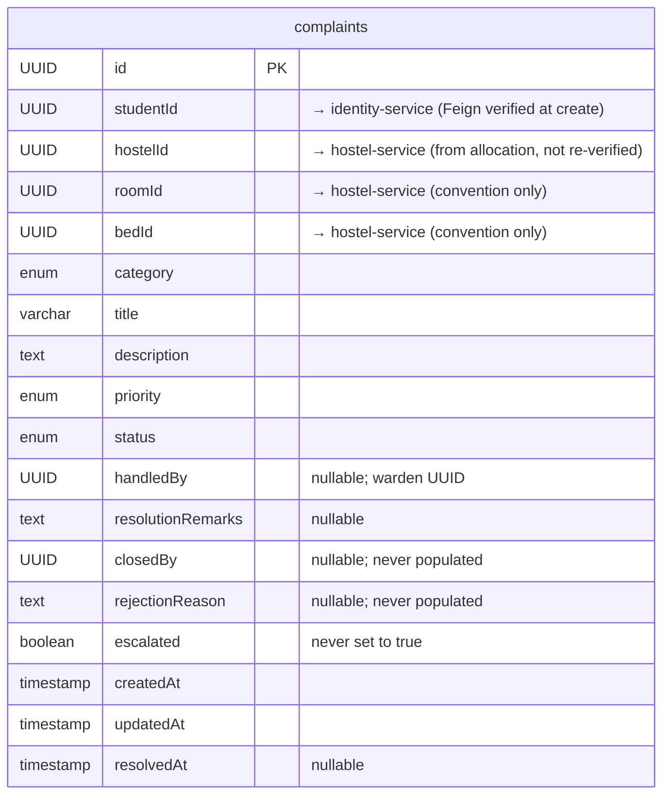

# Complaint Service

> Port: **8094** · DB: `complaint_db` (PostgreSQL) · Config: config-server

---

## Responsibility

Allows students to file complaints about hostel issues and wardens to manage them.
Maintains a status lifecycle (OPEN → IN_PROGRESS → RESOLVED/REJECTED).
Cross-validates student identity via identity-service and hostel context via allocation-service.

---

## Endpoints

### Public (no auth enforced)

(`ComplaintController.java`)

| Method | Path | Key Param | Purpose |
|--------|------|-----------|---------|
| `POST` | `/api/complaints` | `?studentId=UUID` | Create a complaint (student) |
| `GET` | `/api/complaints/{complaintId}` | — | Get a complaint |
| `GET` | `/api/complaints/student/{studentId}` | — | Get all complaints by a student |
| `GET` | `/api/complaints` | `?status=` (optional) | Get all complaints, optionally filtered by status |
| `PUT` | `/api/complaints/{complaintId}` | `?studentId=UUID` | Update complaint title/description (student, OPEN only) |
| `PUT` | `/api/complaints/{complaintId}/status` | `?wardenId=UUID` | Update complaint status (warden) |
| `DELETE` | `/api/complaints/{complaintId}` | `?studentId=UUID` | Delete a complaint (student, OPEN only) |

> ⚠️ Note: there is no `acceptComplaint` endpoint exposed in `ComplaintController.java`.
> The method exists in the service interface/impl (`acceptComplaint`) but has **no matching
> `@RequestMapping` in the controller**. It is unreachable via HTTP today.

---

## Entities / Data Model

### `complaints` table (`Complaint.java`)

| Field | Type | Nullable | Notes |
|-------|------|----------|-------|
| `id` | UUID (PK) | no | |
| `studentId` | UUID | no | → identity-service; verified via Feign at create |
| `hostelId` | UUID | no | sourced from allocation-service; not re-verified vs hostel-service |
| `roomId` | UUID | no | sourced from allocation-service; convention only |
| `bedId` | UUID | no | sourced from allocation-service; convention only |
| `category` | enum | no | see below |
| `title` | varchar(150) | no | |
| `description` | text | no | |
| `priority` | enum (`LOW`, `MEDIUM`, `HIGH`) | no | default `MEDIUM` |
| `status` | enum (`OPEN`, `IN_PROGRESS`, `RESOLVED`, `REJECTED`) | no | default `OPEN` |
| `handledBy` | UUID | yes | warden UUID; set when warden accepts |
| `resolutionRemarks` | text | yes | |
| `closedBy` | UUID | yes | defined in entity; never set by any code found |
| `rejectionReason` | text | yes | defined in entity; never set by any code found |
| `escalated` | boolean | no | default `false`; never set to `true` by any code found |
| `createdAt` | timestamp | no | |
| `updatedAt` | timestamp | no | |
| `resolvedAt` | timestamp | yes | set to `LocalDateTime.now()` when status → RESOLVED; cleared otherwise |

### `ComplaintCategory` enum

`ELECTRICITY`, `PLUMBING`, `CLEANLINESS`, `FOOD`, `FURNITURE`, `ROOM`, `WIFI`, `SECURITY`, `OTHER`

---

## ER Diagram

---

## Feign Clients

| Client | Service | Endpoint | Used for |
|--------|---------|----------|---------|
| `IdentityClient` | identity-service | `GET /api/internal/users/{userId}` | Validate student/warden identity |
| `AllocationClient` | allocation-service | `GET /api/internal/allocations/student/{studentId}` | Retrieve student's hostelId/roomId/bedId at complaint creation |

---

## Service Dependencies

| Direction | Service | How | Reason |
|-----------|---------|-----|--------|
| Calls | identity-service | Feign | Validate student/warden |
| Calls | allocation-service | Feign | Get student's current hostel context |
| Called by | (none) | — | No other service calls complaint-service |

---

## Business Rules (from `ComplaintServiceImpl.java`)

| Rule | Where enforced |
|------|---------------|
| Only STUDENT role can create a complaint | `validateStudent()` — checks `roles.contains("STUDENT")` |
| Student must be ACTIVE | `!user.active()` check |
| Student must have an active allocation to create a complaint | allocation fetched; if no active allocation, Feign throws 404 → propagated as ResourceNotFoundException |
| Only WARDEN role can update complaint status | `validateWarden()` — checks `roles.contains("WARDEN")` |
| Warden must be ACTIVE | `!user.active()` check |
| Warden can only accept complaints in their own hostel | `!warden.hostelId().equals(complaint.getHostelId())` check |
| A complaint already accepted by a warden cannot be accepted again | `complaint.getHandledBy() != null` check |
| Status transition rules (OPEN → IN_PROGRESS or REJECTED; IN_PROGRESS → RESOLVED or REJECTED; terminal states cannot be modified) | `validateStatusChange()` |
| Only OPEN complaints can be deleted by student | `complaint.getStatus() != OPEN` check |
| Only OPEN complaints can be updated by student | checked in `updateComplaint()` |
| Student can only update/delete their own complaint | `validateOwnership()` — `complaint.studentId.equals(studentId)` |
| `resolvedAt` timestamp is set when status → RESOLVED, cleared otherwise | `ComplaintServiceImpl.updateComplaintStatus()` |

---

## Authorization Gaps

**No Spring Security.** No JWT filter. Caller identity is proven only by the UUID
passed in the `?studentId=` or `?wardenId=` request parameter.

| Endpoint | Who should be allowed | What's enforced | Gap |
|----------|-----------------------|-----------------|-----|
| `POST /api/complaints?studentId=X` | The authenticated student X | UUID passed in query param — **anyone can supply any studentId** | Impersonation: caller can file a complaint as any student |
| `PUT /api/complaints/{id}?studentId=X` | The authenticated student X | Same as above | Impersonation: can update any student's complaint |
| `DELETE /api/complaints/{id}?studentId=X` | The authenticated student X | Same as above | Impersonation: can delete any student's OPEN complaint |
| `PUT /api/complaints/{id}/status?wardenId=X` | A warden whose hostelId matches | UUID param — anyone can supply any wardenId | Impersonation: can supply a valid warden UUID and close complaints |
| `GET /api/complaints` | ADMIN / WARDEN | Nothing | Any caller sees all complaints |

---

## Known-Suspect Areas

1. **`acceptComplaint()` exists in service but has no HTTP endpoint**. The controller does not expose a route for it. This means wardens cannot accept complaints via the API today.

2. **`closedBy`, `rejectionReason`, `escalated`** — three fields on the `Complaint` entity that are never written by any service code. They're mapped columns that will always be `null`/`false` in the DB.

3. **`hostelId`/`roomId`/`bedId` on complaint** — sourced from allocation-service at creation time. If a student checks out and is reallocated to a different room before their complaint is resolved, the complaint still references the old hostelId/roomId/bedId with no update mechanism.

4. **Complaint status `CANCELLED`** — not present in `ComplaintStatus` enum (unlike LeaveStatus which has CANCELLED). If a student wants to withdraw a complaint they can only `DELETE` it, and only while OPEN.
