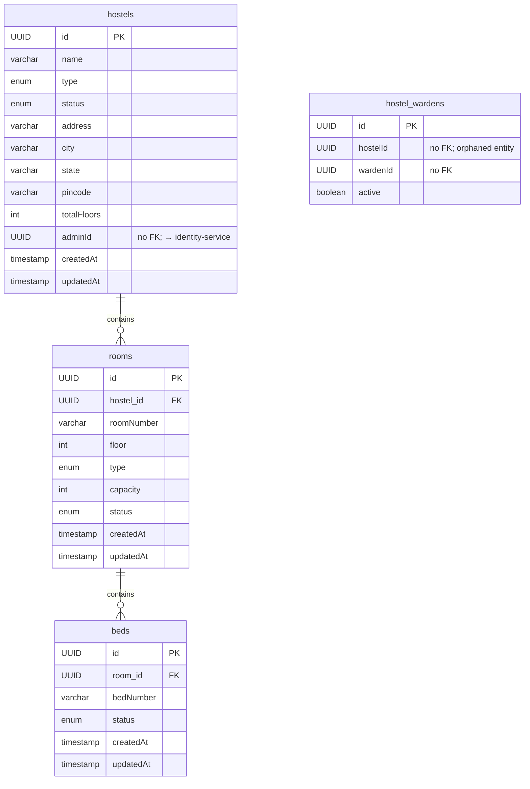

# Hostel Service

> Port: **8092** · DB: `hostel_db` (PostgreSQL) · Config: config-server

---

## Responsibility

Manages the physical hostel hierarchy: Hostel → Room → Bed.
Exposes public CRUD endpoints for hostel management and internal endpoints
used exclusively by allocation-service (bed state transitions).

---

## Endpoints

### Public (no auth enforced by this service)

#### Hostels (`HostelController.java`)

| Method | Path | Purpose |
|--------|------|---------|
| `POST` | `/api/hostels` | Create a hostel |
| `GET` | `/api/hostels/{hostelId}` | Get a hostel by ID |
| `GET` | `/api/hostels?search=&city=&type=&status=` | Search/filter hostels (paginated, default page size 10, sorted by name) |
| `PUT` | `/api/hostels/{hostelId}` | Update a hostel |
| `DELETE` | `/api/hostels/{hostelId}` | Delete a hostel |

#### Rooms (`RoomController.java`)

| Method | Path | Purpose |
|--------|------|---------|
| `POST` | `/api/hostels/{hostelId}/rooms` | Create a room in a hostel |
| `GET` | `/api/hostels/{hostelId}/rooms` | List/filter rooms (`?status=&type=&floor=`) |
| `GET` | `/api/hostels/{hostelId}/rooms/{roomId}` | Get a specific room |
| `PUT` | `/api/hostels/{hostelId}/rooms/{roomId}` | Update a room |
| `DELETE` | `/api/hostels/{hostelId}/rooms/{roomId}` | Delete a room (only if no beds exist) |

#### Beds (`BedController.java`)

| Method | Path | Purpose |
|--------|------|---------|
| `POST` | `/api/hostels/{hostelId}/rooms/{roomId}/beds` | Create a bed |
| `GET` | `/api/hostels/{hostelId}/rooms/{roomId}/beds` | List/filter beds (`?status=`) |
| `GET` | `/api/hostels/{hostelId}/rooms/{roomId}/beds/{bedId}` | Get a specific bed |
| `PUT` | `/api/hostels/{hostelId}/rooms/{roomId}/beds/{bedId}` | Update a bed |
| `DELETE` | `/api/hostels/{hostelId}/rooms/{roomId}/beds/{bedId}` | Delete a bed |

### Internal (used by other services via Feign)

(`InternalBedController.java`, `InternalHostelController.java`)

| Method | Path | Caller | Purpose |
|--------|------|--------|---------|
| `GET` | `/api/internal/beds/{id}` | allocation-service, complaint-service | Get bed details (hostelId, roomId, status) |
| `PUT` | `/api/internal/beds/{id}/occupy` | allocation-service | Set bed status → `OCCUPIED` |
| `PUT` | `/api/internal/beds/{id}/release` | allocation-service | Set bed status → `AVAILABLE` |
| `GET` | `/api/internal/hostels/{hostelId}` | (no callers found yet) | Get hostel details |

---

## Entities / Data Model

### `hostels` table (`Hostel.java`)

| Field | Type | Nullable | Notes |
|-------|------|----------|-------|
| `id` | UUID (PK) | no | |
| `name` | varchar(150) | no | |
| `description` | varchar(500) | yes | |
| `type` | enum (`BOYS`, `GIRLS`, `MIXED`) | no | default `MIXED` |
| `status` | enum (`ACTIVE`, `INACTIVE`, `UNDER_MAINTENANCE`) | no | default `ACTIVE` |
| `address` | varchar(255) | no | |
| `city` | varchar(100) | no | |
| `state` | varchar(100) | no | |
| `pincode` | varchar(20) | no | |
| `totalFloors` | int | no | default 1 |
| `adminId` | UUID | no | points to identity-service user; **no FK, not verified at write** |
| `createdAt` | timestamp | no | |
| `updatedAt` | timestamp | no | |

### `rooms` table (`Room.java`)

| Field | Type | Nullable | Notes |
|-------|------|----------|-------|
| `id` | UUID (PK) | no | |
| `roomNumber` | varchar(20) | no | unique per hostel |
| `floor` | int | no | must ≤ hostel.totalFloors |
| `type` | enum (`SINGLE`, `DOUBLE`, `TRIPLE`, `FOUR_SHARING`, `FIVE_SHARING`) | no | |
| `capacity` | int | no | must match type (SINGLE→1, DOUBLE→2, …) |
| `status` | enum (`ACTIVE`, `INACTIVE`, `UNDER_MAINTENANCE`) | no | default `ACTIVE` |
| `hostel_id` | UUID (FK → hostels.id) | no | |

### `beds` table (`Bed.java`)

| Field | Type | Nullable | Notes |
|-------|------|----------|-------|
| `id` | UUID (PK) | no | |
| `bedNumber` | varchar(20) | no | unique per room |
| `status` | enum (`AVAILABLE`, `OCCUPIED`, `RESERVED`, `MAINTENANCE`) | no | default `AVAILABLE` |
| `room_id` | UUID (FK → rooms.id) | no | |

### `hostel_wardens` table (`HostelWarden.java`)

| Field | Type | Notes |
|-------|------|-------|
| `id` | UUID (PK) | |
| `hostelId` | UUID | no FK; points to identity-service |
| `wardenId` | UUID | no FK; points to identity-service |
| `active` | boolean | default `true` |

> ⚠️ **`HostelWarden` is an orphaned entity.** It has no repository, no service
> method, and no controller referencing it. It exists as a table definition only.
> No constraint limits how many wardens a hostel can have (even if the entity were used).

---

## ER Diagram

---

## Service Dependencies

| Direction | Service | How | Reason |
|-----------|---------|-----|--------|
| Called by | allocation-service | Feign | Bed lookup + bed state transitions |
| Called by | complaint-service | Feign | Indirect (via allocation-service) |
| Called by | leave-service | Feign | Indirect (via allocation-service) |
| Calls | (none) | — | `@EnableFeignClients` is declared but no client interfaces exist |

---

## Business Rules (from `RoomServiceImpl.java`, `BedServiceImpl.java`)

| Rule | Where enforced |
|------|---------------|
| Room floor must not exceed hostel's `totalFloors` | `validateFloor()` in `RoomServiceImpl` |
| Room capacity must exactly match room type (SINGLE→1, DOUBLE→2, TRIPLE→3, FOUR_SHARING→4, FIVE_SHARING→5) | `validateCapacity()` in `RoomServiceImpl` |
| Room number must be unique within a hostel | DB unique constraint + checked on update if number changed |
| Cannot delete a room that still has beds | `!room.getBeds().isEmpty()` check in `deleteRoom()` |
| Bed number must be unique within a room | DB unique constraint `uk_bed_room_number` |

---

## Authorization Gaps

**No Spring Security.** No JWT filter. No role check anywhere.
Any unauthenticated caller can create, update, or delete any hostel, room, or bed.

| Endpoint | Who should be allowed | What's enforced | Gap |
|----------|-----------------------|-----------------|-----|
| `POST /api/hostels` | ADMIN | Nothing | Anyone |
| `DELETE /api/hostels/{id}` | ADMIN | Nothing | Anyone |
| `PUT /api/internal/beds/{id}/occupy` | allocation-service only | Nothing | Any caller on the network |
| `PUT /api/internal/beds/{id}/release` | allocation-service only | Nothing | Any caller on the network |

---

## Known-Suspect Areas

1. **`RoomResponse` uses `HostelStatus` for its `status` field** but `Room.status` is also typed as `HostelStatus` — the same enum is reused for both hostel and room status. This is not wrong, but the semantic alignment (both have ACTIVE/INACTIVE/UNDER_MAINTENANCE) should be intentional.

2. **`hostel.adminId` is `nullable=false`** but `CreateHostelRequest` must be checked to confirm adminId is required in the request — the entity says non-null but if the DTO doesn't enforce it, it could NPE or fail at DB layer.

3. **`BedStatus` has `RESERVED` and `MAINTENANCE`** values — no code path found that sets a bed to `RESERVED`. May be future/unused.
