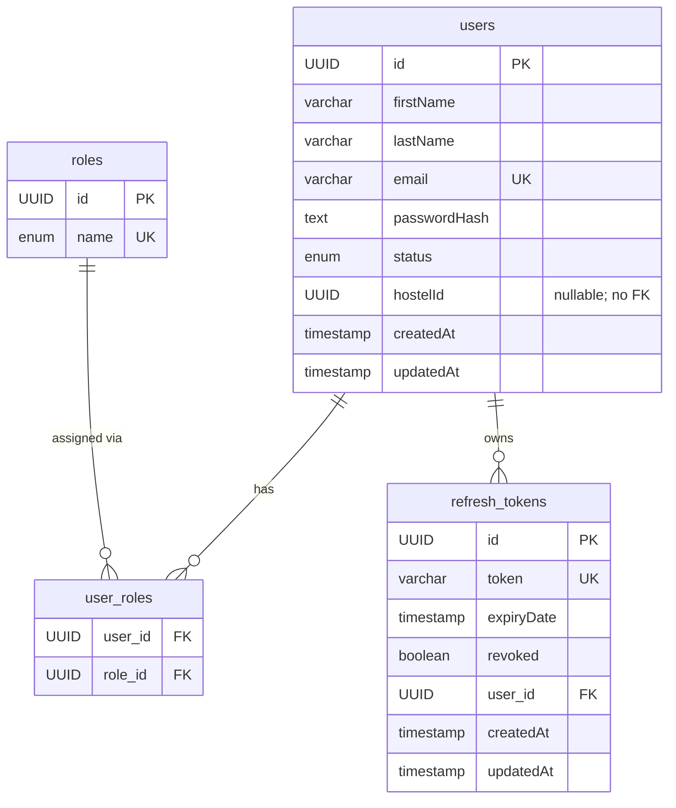

# Identity Service

> Port: **8081** · DB: `identity_db` (PostgreSQL) · Config: **local only** (no config-server)

---

## Responsibility

User registration, login, JWT issuance/refresh/revocation, and user lookup.
The only service in the system with Spring Security and an actual authentication mechanism.
Also acts as the internal user-data source for other services via `/api/internal/users/{id}`.

---

## Endpoints

### Public (no token required)

| Method | Path | Purpose |
|--------|------|---------|
| `POST` | `/api/auth/register` | Register a new student account |
| `POST` | `/api/auth/login` | Authenticate and receive access + refresh tokens |
| `POST` | `/api/auth/refresh` | Exchange a valid refresh token for a new access token |
| `POST` | `/api/auth/logout` | Revoke a refresh token |

### Permitted without auth (security gap — see below)

| Method | Path | Purpose |
|--------|------|---------|
| `GET`  | `/api/auth/token-test` | Debug endpoint — generates a token for hardcoded user `mohini@example.com` |
| `POST` | `/api/auth/admin/wardens` | Create a warden account |
| `POST` | `/api/auth/admin/admins` | Create an admin account |
| `GET`  | `/api/internal/users/{id}` | Internal user lookup (used by other services) |

### Requires authentication

| Method | Path | Purpose |
|--------|------|---------|
| `GET`  | `/api/auth/me` | Returns the currently authenticated user's profile |

---

## Entities / Data Model

### `users` table (`User.java`)

| Field | Type | Nullable | Notes |
|-------|------|----------|-------|
| `id` | UUID (PK, auto-generated) | no | |
| `firstName` | varchar(150) | no | |
| `lastName` | varchar(150) | no | |
| `email` | varchar(255), unique | no | lowercased before save |
| `passwordHash` | text | no | BCrypt encoded |
| `status` | enum (`ACTIVE`, `INACTIVE`, `LOCKED`) | no | default `ACTIVE` |
| `hostelId` | UUID | **yes** | plain UUID, no FK; points to hostel-service. Set at creation time for wardens/admins? Currently no setter endpoint found. |
| `createdAt` | timestamp | no | set by `@PrePersist` |
| `updatedAt` | timestamp | no | updated by `@PreUpdate` |

### `roles` table (`Role.java`)

| Field | Type | Notes |
|-------|------|-------|
| `id` | UUID (PK) | |
| `name` | enum (`STUDENT`, `WARDEN`, `ADMIN`, `SYSTEM_ADMIN`) | unique |

> `SYSTEM_ADMIN` is defined in the enum but **never referenced** in any controller,
> service rule, or security config. Dead code as of this analysis.

### `user_roles` table (join)

Many-to-many between `users` and `roles`. Unique constraint on `(user_id, role_id)`.

### `refresh_tokens` table (`RefreshToken.java`)

| Field | Type | Notes |
|-------|------|-------|
| `id` | UUID (PK) | |
| `token` | varchar(512), unique | UUID-string |
| `expiryDate` | timestamp | 7 days from issue |
| `revoked` | boolean | default `false` |
| `user_id` | UUID (FK → users.id) | many tokens per user |

---

## ER Diagram

---

## Service Dependencies

| Direction | Service | How | Reason |
|-----------|---------|-----|--------|
| Called by | allocation-service | Feign `GET /api/internal/users/{id}` | Validate student before allocation |
| Called by | complaint-service | Feign `GET /api/internal/users/{userId}` | Validate student/warden |
| Called by | leave-service | Feign `GET /api/internal/users/{id}` | Validate student/warden |

---

## Business Rules (from `AuthServiceImpl.java`)

| Rule | Where enforced |
|------|---------------|
| Email must be unique | `userRepository.existsByEmail(email)` before register/createWarden/createAdmin |
| Email is lowercased and trimmed before save | `AuthServiceImpl.register()`, `createWarden()`, `createAdmin()` |
| Password minimum length 8 chars | `@Size(min=8)` on `RegisterRequest`, `CreateWardenRequest`, `CreateAdminRequest` |
| Register always creates role `STUDENT` — not selectable by caller | `AuthServiceImpl.register()` hard-codes `RoleName.STUDENT` |
| `createWarden` / `createAdmin` return an `AuthResponse` with **all null token fields** | `AuthServiceImpl.createWarden()` and `createAdmin()` — the warden/admin is created but receives no tokens |
| Refresh token validity: not revoked + not expired | `RefreshTokenServiceImpl.verifyRefreshToken()` |
| Logout: revokes the provided refresh token only | `RefreshTokenServiceImpl.revokeRefreshToken()` |

---

## Authorization Gaps (this service)

| Endpoint | Who should call it | What's enforced today | Gap |
|----------|-------------------|-----------------------|-----|
| `POST /api/auth/admin/wardens` | ADMIN only | **`permitAll()`** — no token required | Anyone can create a warden |
| `POST /api/auth/admin/admins` | ADMIN only | **`permitAll()`** — no token required | Anyone can create an admin |
| `GET /api/internal/users/**` | Internal services only | **`permitAll()`** — no token required | Any external caller can fetch any user's profile |
| `GET /api/auth/token-test` | Debug/dev only | Not in `permitAll()` — requires auth; but the endpoint itself is a security risk | Debug endpoint leaks a token for `mohini@example.com` |

---

## Known-Suspect Areas

1. **`createWarden` / `createAdmin` return null tokens** — the warden is created successfully, but the response `AuthResponse` has `accessToken=null`, `refreshToken=null`, `user=null`. The caller gets a 201 with a null-filled body. This is likely a bug — the intent was probably to either (a) issue tokens or (b) return a simpler success response.

2. **`hostelId` on `User` entity** — there is no endpoint to set or update it. Wardens presumably need a `hostelId` to pass the `validateWarden()` check in complaint-service and leave-service. How a warden's `hostelId` gets populated is **not found in code**.

3. **`SYSTEM_ADMIN` role** — defined in `RoleName.java` but no business logic references it.

4. **`ChangePasswordRequest.java`** exists as a DTO but there is no controller endpoint or service method that uses it.
