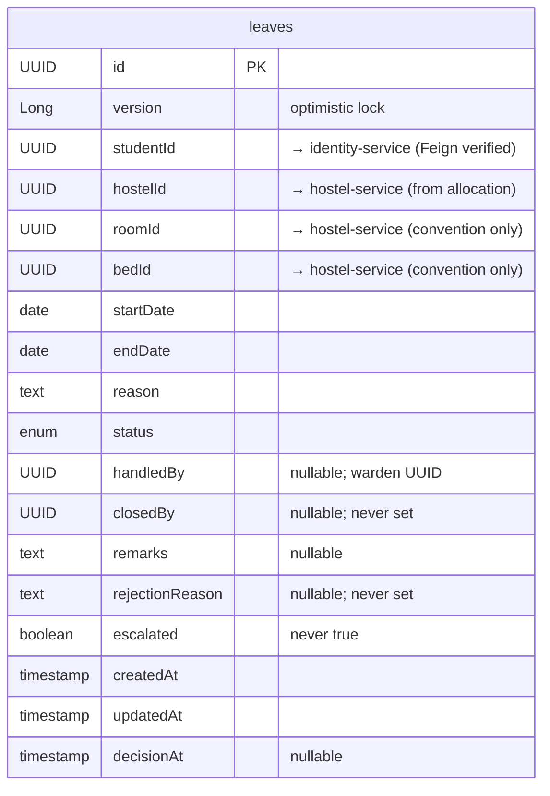

# Leave Service

> Port: **8095** · DB: `hostelhub_leave_db` (PostgreSQL) · Config: config-server

---

## Responsibility

Manages student leave applications. Students apply; wardens accept (move to IN_REVIEW)
and then approve or reject. The service has the most mature business rule set in the
system, including optimistic locking, date overlap validation, and status machine rules.

---

## Endpoints

### Public (no auth enforced)

(`LeaveController.java`)

| Method | Path | Key Param | Purpose |
|--------|------|-----------|---------|
| `POST` | `/api/leaves` | `?studentId=UUID` | Create a leave request (student) |
| `GET` | `/api/leaves/{leaveId}` | — | Get a leave request by ID |
| `GET` | `/api/leaves/student/{studentId}` | — | List all leaves for a student |
| `GET` | `/api/leaves/hostel/{hostelId}` | — | List all leaves for a hostel |
| `GET` | `/api/leaves` | — | List all leaves |
| `GET` | `/api/leaves` | `?status=` | List leaves filtered by status |
| `PUT` | `/api/leaves/{leaveId}` | `?studentId=UUID` | Update a leave (student, PENDING only) |
| `DELETE` | `/api/leaves/{leaveId}` | `?studentId=UUID` | Delete/cancel a leave (student, PENDING only) |
| `PUT` | `/api/leaves/{leaveId}/accept` | `?wardenId=UUID` | Warden accepts leave → IN_REVIEW |
| `PUT` | `/api/leaves/{leaveId}/status` | `?wardenId=UUID` | Warden approves/rejects (APPROVED/REJECTED) |

---

## Entities / Data Model

### `leaves` table (`Leave.java`)

| Field | Type | Nullable | Notes |
|-------|------|----------|-------|
| `id` | UUID (PK) | no | |
| `version` | Long | no | `@Version` optimistic lock — prevents concurrent accept race |
| `studentId` | UUID | no | → identity-service; verified via Feign |
| `hostelId` | UUID | no | sourced from allocation-service; not re-verified |
| `roomId` | UUID | no | sourced from allocation-service; convention only |
| `bedId` | UUID | no | sourced from allocation-service; convention only |
| `startDate` | date | no | |
| `endDate` | date | no | |
| `reason` | text | no | |
| `status` | enum | no | default `PENDING` |
| `handledBy` | UUID | yes | warden UUID who accepted |
| `closedBy` | UUID | yes | defined; never set by code found |
| `remarks` | text | yes | |
| `rejectionReason` | text | yes | defined; never set by code found |
| `escalated` | boolean | no | default `false`; never set to `true` |
| `createdAt` | timestamp | no | |
| `updatedAt` | timestamp | no | |
| `decisionAt` | timestamp | yes | |

### `LeaveStatus` enum (`LeaveStatus.java`)

| Value | Meaning |
|-------|---------|
| `PENDING` | Student submitted; awaiting warden pickup |
| `IN_REVIEW` | Warden accepted; actively being reviewed |
| `APPROVED` | Warden approved |
| `REJECTED` | Warden rejected |
| `CANCELLED` | Student cancelled (only while PENDING) |

---

## ER Diagram

---

## Feign Clients

| Client | Service | Endpoint | Used for |
|--------|---------|----------|---------|
| `IdentityClient` | identity-service | `GET /api/internal/users/{id}` | Validate student/warden at every write operation |
| `AllocationClient` | allocation-service | `GET /api/internal/allocations/student/{studentId}` | Get student's hostelId/roomId/bedId at leave creation |

---

## Service Dependencies

| Direction | Service | How | Reason |
|-----------|---------|-----|--------|
| Calls | identity-service | Feign | Validate student + warden on every write |
| Calls | allocation-service | Feign | Get student's allocation context for leave creation |
| Called by | (none) | — | No other service calls leave-service |

---

## Business Rules (from `LeaveServiceImpl.java`)

| Rule | Where enforced |
|------|---------------|
| Only STUDENT role can apply for leave | `validateStudent()` |
| Student must be ACTIVE | `!user.active()` check |
| Start date must not be in the past | `startDate.isBefore(LocalDate.now())` |
| Start date must be before or equal to end date | `startDate.isAfter(endDate)` check |
| `@Future` constraint on both dates in DTO | `CreateLeaveRequest` and `UpdateLeaveRequest` |
| Student must not have an overlapping PENDING or IN_REVIEW leave | `validateNoOverlap()` — date range intersection check |
| Only WARDEN can accept or approve/reject a leave | `validateWarden()` |
| Warden must be ACTIVE | `!user.active()` check |
| Warden must be assigned to a hostel (`hostelId` non-null) | `user.hostelId() == null` check |
| Warden can only manage leaves from their own hostel | `validateSameHostel()` — `warden.hostelId().equals(leave.hostelId)` |
| Status transitions: PENDING→IN_REVIEW (accept); IN_REVIEW→APPROVED or REJECTED | `validateStatusChange()` |
| APPROVED, REJECTED, CANCELLED states are terminal — cannot be modified | same method |
| Cannot move back to PENDING | same method |
| Cannot update/delete a leave that is not PENDING | checked in `updateLeave()` and `deleteLeave()` |
| Student can only modify their own leave | `validateOwnership()` |
| Optimistic locking on `acceptLeave()` | `@Version` on `Leave.version` prevents two wardens winning the race |

---

## Authorization Gaps

**No Spring Security.** No JWT filter. Same pattern as complaint-service.

| Endpoint | Who should be allowed | What's enforced | Gap |
|----------|-----------------------|-----------------|-----|
| `POST /api/leaves?studentId=X` | The authenticated student X | UUID in query param only | Any caller can apply for leave as any student |
| `PUT /api/leaves/{id}?studentId=X` | Student X | Same | Impersonation |
| `DELETE /api/leaves/{id}?studentId=X` | Student X | Same | Impersonation |
| `PUT /api/leaves/{id}/accept?wardenId=X` | Warden X of student's hostel | Hostel-matching IS checked (after Feign lookup) | But `wardenId` itself is unverified — any UUID accepted |
| `PUT /api/leaves/{id}/status?wardenId=X` | Warden X | Hostel-matching checked | `wardenId` unverified |
| `GET /api/leaves` | ADMIN / WARDEN | Nothing | All leave records exposed |
| `GET /api/leaves/hostel/{hostelId}` | ADMIN / WARDEN of that hostel | Nothing | Anyone can list a hostel's leaves |

---

## Known-Suspect Areas

1. **`closedBy`, `rejectionReason`, `escalated`** — same as complaint-service: defined in entity, never written. The `rejectionReason` field is particularly notable: when a warden rejects a leave, there is no mechanism to record why.

2. **`LeaveServiceApplication.java` compilation issue**: The file references `@EnableDiscoveryClient` and `@EnableFeignClients` annotations, but the import statements are missing from the source. This would cause a compile error. (The application may still work if these are in the classpath auto-configuration, but the annotation is unresolved.)

3. **`@Future` on `startDate`**: The Jakarta `@Future` annotation requires the date to be strictly in the future (i.e., not today). The service-level check `startDate.isBefore(LocalDate.now())` allows today as a start date. These two rules contradict — Bean Validation would reject today's date, but the service logic would accept it.

4. **`getMyLeaves()` vs `getStudentLeaves()`** — both methods exist in the service interface and call the same `leaveRepository.findByStudentId()`. They are identical. The controller only exposes `getStudentLeaves()` (`GET /student/{studentId}`); `getMyLeaves()` is dead code.

5. **Feign error handling on allocation** — if a student has no active allocation, `fetchAllocation()` catches `FeignException.NotFound` and **returns `null`**. Downstream code then tries to access `allocation.hostelId()` without a null check, which will throw NPE at leave creation for a student with no allocation.
